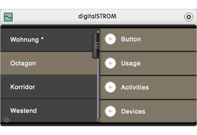
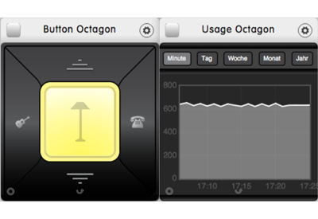
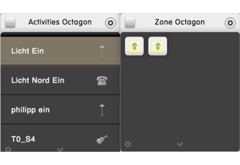

# digitalSTROM

**Table of contents**

1. Screenshots
2. Description
3. What is new in V0.1
4. Works well with
5. Additional information

## Screenshots

## Description

The digitalSTROM dizmos can not only be used to call digitalSTROM scenes with buttons and scene dizmos, but they can also be used to configure digitalSTROM! 

If for example a light is in the wrong room in the digitalSTROM configuration, simply start the two zone dizmos, and drag the device from one room to another, and your digitalSTROM configuration will be changed accordingly! 

Use the settings of the scene dizmo to programm your digitalSTROM scenes. Set values for devices with the device dizmos of a zone, and save the scenes in the scene dizmo.

## What is new in V0.1

Initial version of the dizmos

## Works well with

(Optional) List the hardware and/or the dizmos with which your dizmo can be used.

## Additional Information

* Developer: Micha Surber futureLAB AG
* Publisher: Micha Surber futureLAB AG
* Contact: msurber@futurelab.ch
* Website: http://www.futurelab.ch
